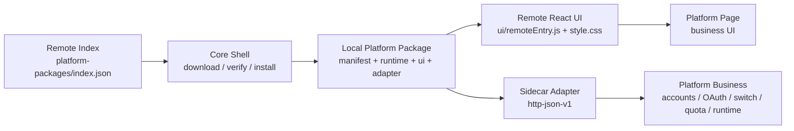

# 平台热更新架构方案

本文档定义后续平台独立升级管理的统一架构。Zed 是第一个完整实现平台，Kiro 是第一个同时覆盖账号总览和多开实例业务 tabs 的迁移平台，GitHub Copilot 是第一个覆盖 VS Code 切号、OpenCode 同步、实例管理、托盘/菜单和 token keeper 隐藏入口的平台，Windsurf 是第一个覆盖 token 登录、邮箱密码登录、Devin 授权、默认 profile 回写、Web report 和保活回写的迁移平台，Cursor 是第一个按 Windsurf 同类 IDE 模板完成账号、OAuth、默认 profile 写入、多开实例和隐藏入口 gate 的迁移平台，Gemini 是第一个覆盖 CLI launch command 语义、默认 `~/.gemini`/`GEMINI_CLI_HOME` 凭证写入、OAuth 恢复和 Web report gate 的迁移平台，Trae 是第一个覆盖运行中实例保护、严格 CheckLogin 校验和默认客户端注入保护的迁移平台，Qoder 是第一个覆盖 Qoder 官方 OAuth/OpenAPI 刷新、多开实例、Web report、浮动卡片和路径重试 gate 的迁移平台，CodeBuddy 是第一个覆盖 `state.vscdb` Token/本地导入、默认客户端注入、多开实例、设置页账号覆盖、Web report、浮动卡片和路径重试 gate 的迁移平台，CodeBuddy CN 是第一个覆盖套件共享 UI、独立 CN 安装态、WorkBuddy 同步、CN `state.vscdb` secret 和隐藏入口 gate 的迁移平台，Claude 是第一个从 `coreNativeBoundary` 过渡态升级为完整 `sidecarAdapter` 的高复杂度平台，WorkBuddy 是第一个覆盖共享 auth 文件读写、签到、反向同步 CodeBuddy CN、默认 `.workbuddy/app` 数据目录和同套件独立安装态的完整 sidecar 模板，Codex 是第一个覆盖账号、API 服务、本地网关、模型供应商、唤醒任务、会话管理、线程同步和多开实例的大体量完整 `sidecarAdapter` 平台；后续新平台接入或旧平台迁移必须按本文档作为模板执行。当前长期目标是“平台相关的一切都可独立热更新”，因此 `coreNativeBoundary` 只能作为迁移过渡态，不再作为最终完成标准。

## 1. 目标

平台热更新要解决的问题：

1. 用户只使用部分平台时，不应因为某个平台更新而被迫更新整个应用。
2. 平台管理里可以真实安装、卸载、更新、检查更新、查看包大小和更新日志。
3. 平台页面内的 UI、tabs、筛选、弹框、账号卡片、交互可以随平台包独立发版。
4. 平台账号、OAuth、切号、配额、runtime 等业务逻辑可以随平台包 adapter 独立发版。
5. 卸载平台包后，平台业务区必须不可见且不加载业务逻辑；入口仍可按用户布局偏好显示为未安装状态。
6. 最终完成标准是平台相关 UI 和业务逻辑全部进入平台包：页面 UI、tabs、弹框、账号、OAuth、切号、配额、实例、runtime、后台刷新、token keeper、Web report、浮动卡片、托盘/菜单业务数据、导入导出和数据备份中的平台业务部分都必须由 remote UI 或 sidecar adapter 提供。

非目标：

1. 卸载平台包不删除用户电脑上的官方客户端。
2. 卸载平台包不默认删除本项目保存的账号主数据。
3. 远端更新不直接执行 GitHub raw 上的 JS；必须先下载到本地并校验。

## 2. 总体架构



架构由五部分组成：

1. **Core Shell**：主应用内核，只负责平台生命周期、状态管理、下载校验、Host API、adapter runner、统一入口 gate、通用不可用页和右上角平台包操作。
2. **Platform Package**：平台适配包，包含 `manifest.json`、`runtime/index.json`、UI runtime、sidecar adapter、资源、changelog 和包元数据。
3. **Remote React UI**：平台页面 UI 热更新主路径。平台包提供 `react-remote-esm-v1` module，宿主从本地已安装包加载。
4. **Sidecar Adapter**：平台业务热更新主路径。平台包提供本地 adapter 进程，通过稳定 `http-json-v1` 协议暴露业务能力。
5. **runtimeReady gate**：业务入口唯一放行条件。只有平台包完整校验通过后才能加载 UI 和调用业务命令；页面、Dashboard、托盘/菜单、自动刷新、账号迁移、数据备份、浮动卡片、Web report、token keeper 等隐藏入口都必须进入同一 gate。

## 3. 边界分工

### 3.1 Core Shell 职责

Core Shell 只允许保留这些能力：

1. 平台包下载、校验、安装、更新、回滚、卸载。
2. 平台包注册表和状态：`installStatus`、`runtimeReady`、版本、包大小、错误信息、changelog。
3. 侧边栏、仪表盘、托盘/菜单栏入口容器。
4. 平台页外壳、右上角平台包状态徽标、通用未安装/需修复页面。
5. 不包含业务含义的宿主布局 slot，例如平台切换行内的 remote tabs slot。
6. Host API 和稳定 Tauri command facade。
7. adapter runner：启动、复用、停止平台包内 sidecar。
8. Host Event Bridge：接收平台 adapter 上报的结构化事件并转发为 Tauri/WebView 事件。

Core Shell 不应继续承载已迁移平台的业务 UI：

1. 账号总览。
2. 业务 tabs。
3. 筛选栏、账号卡片、表格、空态。
4. 平台专属弹框。
5. 实例页或 runtime 业务区。

### 3.1.1 Host Event Bridge 规则

依赖进度、流式输出、OAuth 回调状态、任务确认或批量执行状态的平台业务，必须通过 Host Event Bridge 迁入 sidecar adapter：

1. Core Shell 启动 adapter 时通过环境变量注入 `COCKPIT_HOST_EVENT_URL` 和 `COCKPIT_HOST_EVENT_TOKEN`。
2. adapter 在业务执行过程中向该 URL `POST` JSON：`{"event":"事件名","payload":{...}}`。
3. Core Shell 只校验 token、转发 `app.emit(event, payload)`，不得在事件桥内计算平台业务状态、改写 payload 或执行平台专属逻辑。
4. 事件名和 payload 必须保持迁移前前端监听格式不变；remote UI 不应因为迁移到 sidecar 而改事件协议。
5. 事件桥属于通用 Core Shell 能力，不列入平台业务 `nativeBoundaries`；但产生事件的业务命令必须在 adapter 中执行，不能把业务流程留在宿主再宣称热更新。
6. 事件桥失败必须让当前 adapter 调用返回错误或在当前业务操作区显示失败，禁止静默丢失关键进度或流式输出。

### 3.1.2 隐藏后台入口与 DTO 边界

平台热更新验收不能只看页面和显式按钮；所有不直接出现在平台页里的后台业务入口也必须进入 adapter 边界：

1. `provider_token_keeper`、`web_report`、`provider_current`、托盘、macOS 原生菜单、浮动卡片、自动刷新、账号迁移、数据备份/恢复、路径重试和启动恢复等入口，禁止直接读取平台账号文件、解释平台 token 刷新规则或调用平台业务模块。
2. 隐藏入口必须调用窄 adapter 方法，例如 `accounts.keepaliveDue`、`quota.refreshAll`、`accounts.list`、`accounts.pickAutoSwitchTarget`、`instances.store.get`、`instances.store.replace`、`runtime.detectLaunchPath`；Core Shell 只负责调度、gate、事件转发和通用系统能力。
3. 宿主 command facade 需要返回平台结构时，DTO 必须放在共享 `models` 层，或在 facade 中使用 `serde_json::Value` 透传；禁止为了复用类型而 `use crate::modules::<platform>...`，否则会把已迁移平台业务模块重新编译回主应用。
4. `src-tauri/src/modules/mod.rs` 不得声明已迁移平台的业务模块；即使旧源码仍留在仓库供 adapter/core crate 迁移参考，也不能通过宿主模块表编译进 Core Shell。
5. `npm run audit:platform-full-hot-update` 必须扫描 manifest/runtime/index、宿主模块声明和宿主直接引用；只要发现非空 `nativeBoundaries`、旧平台模块声明或 `crate::modules::<platform>` 直接业务引用，就不能宣称该平台完整热更新。

### 3.2 Platform Package 职责

平台包必须承载平台可独立变化的内容：

1. `manifest.json` 和 `runtime/index.json`。
2. `ui/remoteEntry.js` 和 `ui/style.css`。
3. `adapter/<os>/<arch>/...`。
4. changelog。
5. 平台资源、图标、文案 contribution。
6. 平台业务协议方法列表。

## 4. 平台包 manifest 模板

```json
{
  "id": "zed",
  "platformId": "zed",
  "version": "0.26.7",
  "apiVersion": 1,
  "minCoreVersion": "0.26.5",
  "displayName": "Zed",
  "entry": "runtime/index.json",
  "packageMode": "hotUpdate",
  "installKind": "sidecarAdapter",
  "adapter": {
    "protocol": "http-json-v1",
    "entry": "adapter/macos/cockpit-zed-adapter",
    "macosEntry": "adapter/macos/cockpit-zed-adapter",
    "windowsEntry": "adapter/windows/cockpit-zed-adapter.exe",
    "linuxEntry": "adapter/linux/cockpit-zed-adapter",
    "methods": [
      "health.check",
      "accounts.list",
      "oauth.start",
      "switch.inject",
      "quota.alertPayload",
      "runtime.status"
    ]
  },
  "ui": {
    "protocol": "react-remote-esm-v1",
    "entry": "ui/remoteEntry.js",
    "style": "ui/style.css",
    "exports": ["mount", "unmount"]
  },
  "capabilities": ["accounts", "oauth", "switch", "quota", "runtime"],
  "changelog": [
    {
      "version": "0.26.7",
      "date": "2026-06-22",
      "notes": ["Zed 页面 UI 和业务逻辑由平台包提供。"]
    }
  ],
  "contributions": {
    "platforms": [
      {
        "id": "zed",
        "label": "Zed",
        "labelKey": "nav.zed",
        "iconKey": "zed",
        "page": "zed"
      }
    ],
    "dataPaths": ["zed_accounts.json", "zed_accounts"],
    "localStorageKeys": ["agtools.zed.accounts.cache"],
    "nativeBoundaries": []
  }
}
```

强制规则：

1. `manifest.json` 与 `runtime/index.json` 的 `adapter`、`ui`、`capabilities`、`contributions` 必须一致。
2. `installKind=sidecarAdapter` 时，已迁移业务的 `nativeBoundaries` 必须为空。
3. `installKind=coreNativeBoundary` 只允许用于分阶段迁移；manifest/runtime 必须列出仍留在宿主的 `nativeBoundaries`，并禁止宣称这些业务命令已经可通过平台包远端热更新。
4. 在“平台相关的一切都可独立热更新”的最终验收目标下，所有平台最终都必须升级为 `installKind=sidecarAdapter`，且 `nativeBoundaries=[]`；任何非空 `nativeBoundaries` 都必须被视为待迁移缺口，而不是完成态。
5. `ui.protocol` 必须使用 `react-remote-esm-v1`，除非明确选择第三方强隔离插件模式。
6. `ui.entry` 必须指向包内 `.js` 或 `.mjs` 文件。
7. `ui.exports` 必须至少包含 `mount`。
8. remote UI 构建必须保留真实 ESM 导出，构建后必须验证产物实际存在 `mount` 和 `unmount` export，不能只依赖 manifest 声明。
9. remote UI 产物必须是浏览器/WebView 安全代码，禁止残留 `process.env`、Node-only global 或其它未通过 Host API 提供的运行时依赖。
10. remote CSS 必须 scoped 到平台 root，禁止覆盖 `html`、`body`、`#root`、`:root`、全局 `*` 或宿主布局背景；宿主已经加载的基础设计系统样式不得在 remote 包里重复注入并覆盖。
11. remote UI 不得从宿主页面壳模块导入业务组件；可热更新业务区必须拆成独立业务模块，宿主页面壳和 remote UI 共同引用该业务模块，避免 CSS side effect 把平台包 toolbar、不可用页、runtime host 等宿主样式打进平台包。
12. 调试 remote UI/CSS 时必须同时校验源码包、dist zip 和当前已安装包目录三份产物，不能只看 `platform-packages/<id>/ui` 源码目录；旧 CSS 已注入当前 WebView 时，修复后必须刷新或重启 WebView。
13. 批量导入、批量测试、流式聊天、任务调度等依赖进度事件、取消状态、会话缓存或 `AppHandle.emit` 的命令，迁入 sidecar adapter 前必须先定义 sidecar-to-host 事件桥、轮询状态协议或持久化 session；没有事件/状态协议时必须保留为过渡 `nativeBoundary`，禁止只改 command facade 或只删 boundary。
14. 所有路径必须是安全相对路径，禁止绝对路径和 `..`。

## 5. 远端索引与 artifact

远端 `platform-packages/index.json` 只负责发现版本和下载地址。每个平台包必须按 OS/arch 提供 artifact。

```json
{
  "version": "1",
  "packages": [
    {
      "id": "zed",
      "platformId": "zed",
      "version": "0.26.7",
      "packageMode": "hotUpdate",
      "installKind": "sidecarAdapter",
      "artifacts": [
        {
          "os": "macos",
          "arch": "aarch64",
          "downloadUrl": "https://raw.githubusercontent.com/org/repo/main/platform-packages/dist/zed-0.26.7-macos-aarch64.zip",
          "downloadSizeBytes": 5884337,
          "sha256": "..."
        }
      ]
    }
  ]
}
```

规则：

1. Core Shell 只能下载当前 `os + arch` 匹配的 artifact。
2. 只包含 macOS adapter 的 zip 不得声明为 Windows/Linux 可用。
3. 每个 artifact 必须有真实 `downloadSizeBytes` 和 `sha256`。
4. GitHub Actions 应分别构建 macOS、Windows、Linux adapter，并分别产出 zip。
5. 顶层 `downloadUrl` 可以作为旧客户端兼容字段，但新实现必须优先使用 `artifacts[]`。

### 5.1 标准打包脚本与 CI

平台包 zip 必须通过标准脚本生成，禁止手写临时 zip 命令：

```bash
npm run package:platform -- --platform zed --os macos --arch aarch64 --filename-template os-arch --metadata-out /tmp/zed-platform-package.json
```

规则：

1. `scripts/package-platform-package.cjs` 必须从 `platform-packages/<platformId>` 目录内部压缩内容，zip 根目录必须直接包含 `manifest.json`、`runtime/index.json`、`ui/remoteEntry.js`、`ui/style.css`、`assets/package-info.json` 和当前系统 adapter。
2. 本地维护当前兼容包时可以使用默认 `legacy` 文件名，例如 `zed-0.26.7.zip`；多系统远端包必须使用 `os-arch` 文件名，例如 `zed-0.26.7-macos-aarch64.zip`。
3. CI 不直接改写仓库内 `platform-packages/index.json`，而是为每个 OS/arch 产出 zip 和 metadata JSON；远端 index 应由这些 metadata 汇总生成并人工确认后发布。
4. 只有明确需要刷新本地索引时才允许给脚本传 `--update-index`；更新后必须继续执行 `npm run verify:platform-packages`。
5. `scripts/build-platform-package-index.cjs` 负责把各 OS/arch metadata 汇总成可发布的远端 index，并校验每个平台的 artifact 覆盖完整。
6. `.github/workflows/platform-packages.yml` 是平台包跨系统 artifact 的标准构建入口，必须分别构建 remote UI、sidecar adapter，上传各 OS/arch 的 zip 与 metadata，并在 aggregate job 生成合并后的 `index.json`。

示例：

```bash
npm run package:platform-index -- --metadata-dir platform-packages/dist-ci --verify-zip-dir platform-packages/dist-ci --require-os-arch macos/aarch64,macos/x86_64,linux/x86_64,linux/aarch64,windows/x86_64 --output platform-packages/dist-ci/index.json
```

## 6. 安装、更新、卸载流程

### 6.1 安装

1. 读取远端 index。
2. 选择当前 OS/arch 对应 artifact。
3. 下载 zip 到本地缓存。
4. 校验大小和 `sha256`。
5. 解压到 staging 目录。
6. 校验 `manifest.json`、`runtime/index.json`、UI entry、adapter entry。
7. 原子切换到 `current` 包目录。
8. 写入注册表：`installed=true`、`runtimeReady=true`、版本、包大小。
9. 平台页加载 remote UI。

### 6.2 更新

1. 检查远端 index。
2. 比较 `installedVersion` 与 `latestVersion`。
3. 有新版本时，在平台页右上角徽标菜单显示更新入口。
4. 用户二次确认后下载并校验新包。
5. 安装失败必须回滚旧版本并保留错误信息。
6. 更新成功后重新加载 remote UI 和 adapter。

### 6.3 卸载

1. 只做本项目平台包生命周期清理。
2. best-effort 停止正在运行的 adapter。
3. 删除平台包目录和下载缓存。
4. 写入注册表：`installed=false`、`runtimeReady=false`。
5. 不删除官方客户端。
6. 不默认删除本项目保存的账号主数据。
7. 不删除官方客户端真实登录态。

## 7. 页面交互规则

### 7.1 入口显示与业务可用分离

侧边栏、仪表盘、托盘/菜单栏入口是否显示，取决于：

1. 用户平台布局配置。
2. 平台 contribution 是否存在。
3. 远端配置是否隐藏。

业务是否可用，只取决于：

1. `packageMode=hotUpdate`。
2. `installStatus` 是已安装或可更新。
3. `runtimeReady=true`。

未安装平台仍可以在侧边栏和仪表盘显示，但只能展示短状态并导航到平台页。

### 7.2 平台页

平台页必须始终可打开。

`runtimeReady=false` 时：

1. 显示通用不可用页。
2. 通用不可用页可以提供安装或修复主按钮，方便用户直接完成当前平台包初始化。
3. 显示右上角平台包状态徽标，保留完整平台包操作菜单。
4. 不加载 remote UI。
5. 不读取账号。
6. 不启动 OAuth。
7. 不切号。
8. 不后台刷新配额。
9. 账号迁移、数据备份/恢复、导入导出、设置页账号覆盖、浮动卡片、Web report、provider current、token keeper、路径重试等全局工具必须同样 respect `runtimeReady`；未安装时只能跳过或显示平台不可用，禁止调用平台业务命令。

`runtimeReady=true` 时：

1. Core Shell 加载 `ui/style.css`。
2. Core Shell 动态加载 `ui/remoteEntry.js`。
3. Core Shell 可以提供不含业务含义的布局 slot，例如 `tabsSlotId`，用于保持原页面视觉位置。
4. 调用 `mount(container, hostApi)`。
5. 页面业务区、业务 tabs 和 tab 内容由平台包 UI 渲染。

### 7.3 平台包操作入口

安装或修复可以在通用不可用页提供主按钮，按钮必须复用平台包生命周期逻辑和二次确认弹框。

检查更新、更新日志、更新、卸载，以及已安装态的完整平台包操作，统一放在平台页右上角紧凑状态徽标里。

侧边栏和仪表盘只展示状态，不承载安装、更新、卸载动作。

所有安装、修复、更新、卸载都必须二次确认。失败必须显示在当前弹框或当前操作区。

## 8. Remote React UI 协议

remote module 必须导出：

```ts
export function mount(container: HTMLElement, hostApi: PlatformHostApi): void | (() => void);
export function unmount(container: HTMLElement): void;
```

`hostApi` 至少包含：

```ts
type PlatformHostApi = {
  platformId: string;
  packageVersion: string | null;
  locale: string;
  theme: string;
  state: PlatformPackageState;
  tabsSlotId?: string;
};
```

规则：

1. remote UI 运行在宿主 WebView 上下文，优先保证原页面体验和迁移成本。
2. remote UI 不应手写一套近似页面；应拆出原 React 业务组件进行平台包构建。
3. remote UI 只能依赖稳定 Host API 或稳定 Tauri command facade。
4. remote UI 必须自己负责业务 tabs 的按钮、数量、切换状态和内容；宿主最多提供空 slot，不得继续渲染已迁移平台的业务 tab。
5. 页面切换、包更新、卸载前必须调用 cleanup 或 `unmount`。
6. `iframe-html-v1` 只作为第三方强隔离插件可选方案，不作为本项目平台迁移主路径。

## 9. Sidecar Adapter 协议

adapter 使用本地 `http-json-v1`：

1. Core Shell 启动包内 adapter。
2. adapter 绑定 `127.0.0.1:0`。
3. adapter stdout 输出启动握手信息。
4. Core Shell 使用 bearer token 调用 `/rpc`。
5. adapter 按 `method + payload` 返回 JSON。

请求：

```json
{
  "method": "accounts.list",
  "payload": {}
}
```

响应：

```json
{
  "ok": true,
  "data": []
}
```

错误：

```json
{
  "ok": false,
  "error": { "message": "..." }
}
```

账号类平台 adapter 至少覆盖：

1. `accounts.list`
2. `accounts.current`
3. `accounts.delete`
4. `accounts.deleteMany`
5. `accounts.importJson`
6. `accounts.importLocal`
7. `accounts.export`
8. `accounts.refresh`
9. `accounts.refreshAll`
10. `accounts.updateTags`
11. `oauth.start`
12. `oauth.peek`
13. `oauth.complete`
14. `oauth.cancel`
15. `oauth.submitCallbackUrl`
16. `oauth.restorePendingListener`
17. `switch.inject`
18. `switch.logoutCurrent`
19. `quota.alertPayload`
20. `runtime.status`
21. `runtime.startDefault`
22. `runtime.stopDefault`
23. `runtime.restartDefault`
24. `runtime.focusDefault`

如果平台包含实例管理、多开、会话、模型供应商等额外业务 tab，也必须把对应业务方法放入 adapter methods，例如 Kiro 必须额外覆盖：

1. `accounts.addToken`
2. `accounts.indexPath`
3. `instance.getDefaults`
4. `instance.list`
5. `instance.create`
6. `instance.update`
7. `instance.delete`
8. `instance.start`
9. `instance.stop`
10. `instance.closeAll`
11. `instance.openWindow`

如果平台包含 token 登录、邮箱密码登录、批量导入、Devin 授权或默认 profile 回写，也必须把这些业务方法纳入 adapter methods，例如 Windsurf 必须额外覆盖：

1. `accounts.addToken`
2. `accounts.addPassword`
3. `accounts.addPasswordBatch`
4. `accounts.indexPath`
5. `switch.injectDefaultProfile`
6. `instance.getDefaults`
7. `instance.list`
8. `instance.create`
9. `instance.update`
10. `instance.delete`
11. `instance.start`
12. `instance.stop`
13. `instance.closeAll`
14. `instance.openWindow`

如果平台的启动交互不是直接控制客户端窗口，而是生成命令并交给终端执行，也必须把命令生成和执行放入 adapter methods，例如 Gemini 必须额外覆盖：

1. `instance.getLaunchCommand`
2. `instance.executeLaunchCommand`

这类平台的 `instance.start` 只允许保持原业务语义，例如准备 profile、写入凭证和更新实例状态；不得在迁移时私自改成直接启动或聚焦客户端。

## 10. 新平台迁移模板

迁移任意平台时按以下顺序执行：

1. 定义平台包 ID、平台 ID、能力列表和页面 contribution。
2. 梳理现有页面，把业务 UI 拆成 remote React 入口。
3. 梳理现有后端命令，把账号、OAuth、切号、配额、runtime 等业务迁到 sidecar adapter。
4. 保留 Core Shell 的稳定 command facade，让前端不直接依赖 adapter 细节。
5. 编写 `manifest.json` 和 `runtime/index.json`。
6. 构建 `ui/remoteEntry.js` 和 `ui/style.css`。
7. 构建各 OS/arch adapter artifact。
8. 用 `npm run package:platform` 打包 zip，计算大小和 `sha256`。
9. 更新 `platform-packages/index.json` 的 `artifacts[]`。
10. 执行 `npm run verify:platform-packages`，确认预期平台集合、标准打包脚本/CI workflow、manifest、runtime、index、dist zip、artifact size/sha、更新日志、`assets/package-info.json`、remote UI 导出、remote source 复用原业务 content、zip 内容、sidecar adapter crate/workspace/binary、宿主平台包清单、生命周期入口、平台页壳 `runtimeReady` gate 和隐藏入口 gate 一致；隐藏入口审计至少覆盖 Dashboard、SideNav、平台布局弹框、App 路由、自动刷新、账号迁移、数据备份/恢复、浮动卡片、托盘、macOS 原生菜单、token keeper、Web report 和 provider current。
11. 接入平台页右上角 `PlatformPackageToolbar`。
12. 接入通用不可用页和 `runtimeReady` gate。
13. 接入 Dashboard、托盘/菜单、自动刷新、账号迁移、数据备份/恢复、Web report、provider current、token keeper、浮动卡片和路径重试等隐藏入口 gate。
14. 验证安装、卸载、更新、更新日志、包大小、UI 加载、adapter 方法和隐藏入口 gate。

## 11. 验收标准

完整平台迁移必须满足：

1. 未安装时，平台页可打开，但业务区不可见。
2. 未安装时，已勾选侧边栏/仪表盘入口仍显示未安装状态。
3. 安装必须真实下载或复制平台包，并写入本地注册表。
4. 卸载必须真实删除本项目平台包目录。
5. 更新必须真实替换本地平台包。
6. 包大小必须来自真实 artifact 或本地目录。
7. 更新日志必须来自平台包 metadata。
8. `runtimeReady=false` 时不得加载 remote UI 或业务命令。
9. `runtimeReady=true` 后，页面 UI 与迁移前体验不明显回退。
10. 页面 UI 改动可通过平台包版本发布。
11. 业务 adapter 改动可通过平台包版本发布。
12. Windows/Linux 未构建 artifact 前，不得显示为可安装可用。

## 12. 模板平台落地要求

Zed 是首个模板平台，必须一次性做到：

1. `installKind=sidecarAdapter`。
2. `ui.protocol=react-remote-esm-v1`。
3. 业务 UI 使用原 `ZedAccountsContent` 拆包构建，不重写近似 UI。
4. 宿主 `ZedAccountsPage` 只保留页面壳、右上角包操作和 runtime gate。
5. 所有 Zed 账号、OAuth、切号、配额、runtime 命令都通过 adapter facade。
6. zip 包含 `manifest.json`、`runtime/index.json`、`ui/remoteEntry.js`、`ui/style.css` 和当前 OS adapter。
7. 远端 index 使用 `artifacts[]`。
8. 安装、修复、更新、卸载都有二次确认。
9. 卸载后不显示账号总览、tabs、工具栏、账号卡片和专属弹框。

Kiro 是第二个模板平台，必须在 Zed 模板基础上额外做到：

1. 账号总览和多开实例两个业务 tab 都由 Kiro remote UI 渲染，宿主只提供 remote tabs slot。
2. 宿主 `KiroAccountsPage` 只保留页面壳、右上角包操作、remote tabs slot、通用不可用页和 `runtimeReady` gate。
3. `KiroAccountsContent` 必须承载原账号总览 UI，`KiroInstancesContent` 必须继续复用原实例管理组件，禁止手写近似页替代。
4. 所有 Kiro 账号、OAuth、切号、配额、实例和 runtime 命令都通过 `cockpit-kiro-adapter` facade 执行；宿主 command 只允许做 gate、事件转发和托盘刷新。
5. 侧边栏、仪表盘、托盘刷新和自动刷新必须 respect Kiro `runtimeReady`，未安装时只显示状态和入口，不读取账号、不刷新配额、不启动实例。
6. Kiro `manifest.json`、`runtime/index.json`、`platform-packages/index.json` 的 methods、capabilities、contributions 必须一致。

GitHub Copilot 是第三个模板平台，必须在 Zed/Kiro 模板基础上额外做到：

1. 账号总览、多开实例、VS Code 切号、OpenCode 授权同步、OAuth、配额刷新和 runtime 都必须通过 `cockpit-github-copilot-adapter` 暴露。
2. 宿主 `GitHubCopilotAccountsPage` 只保留页面壳、平台切换入口、右上角包操作、remote tabs slot、通用不可用页和 `runtimeReady` gate。
3. `GitHubCopilotAccountsContent` 必须承载迁移前账号总览 UI，实例 tab 必须继续复用原实例管理交互，禁止手写近似页替代。
4. Dashboard、全局托盘刷新、macOS 原生菜单、自动刷新和 token keeper 都必须 respect GitHub Copilot `runtimeReady`；未安装时不得读取 GitHub Copilot 账号、刷新配额、同步 OpenCode 或启动 VS Code 实例。
5. GitHub Copilot sidecar adapter 必须覆盖 `accounts.*`、`quota.*`、`oauth.*`、`switch.*`、`instance.*` 和 `runtime.*`，宿主 command 只允许做 gate、事件转发、托盘刷新和 path missing 事件桥接。
6. GitHub Copilot `manifest.json`、`runtime/index.json`、`platform-packages/index.json` 的 methods、capabilities、contributions、artifact size 和 sha256 必须一致。

Windsurf 是第四个模板平台，必须在 GitHub Copilot 模板基础上额外做到：

1. 账号总览、多开实例、VS Code 注入、OAuth、token 登录、邮箱密码登录、批量密码导入、Devin 授权、配额刷新和 runtime 都必须通过 `cockpit-windsurf-adapter` 暴露。
2. 宿主 `WindsurfAccountsPage` 只保留页面壳、平台切换入口、右上角包操作、remote tabs slot、通用不可用页和 `runtimeReady` gate。
3. `WindsurfAccountsContent` 必须承载迁移前账号总览 UI，实例 tab 必须继续复用原实例管理交互，禁止手写近似页替代。
4. Dashboard、全局托盘刷新、macOS 原生菜单、自动刷新、token keeper 和 Web report 都必须 respect Windsurf `runtimeReady`；未安装时不得读取 Windsurf 账号、刷新配额、回写默认 profile 或启动 Windsurf 实例。
5. token keeper 只允许通过 adapter 刷新 token；当前账号回写默认 profile 必须通过 `switch.injectDefaultProfile` 这类不会启动官方客户端的 adapter 方法完成，禁止为了保活调用会启动 IDE 的切号方法。
6. Windsurf sidecar adapter 必须覆盖 `accounts.*`、`quota.*`、`oauth.*`、`switch.*`、`instance.*` 和 `runtime.*`，宿主 command 只允许做 gate、事件转发、托盘刷新和 path missing 事件桥接。
7. Windsurf `manifest.json`、`runtime/index.json`、`platform-packages/index.json` 的 methods、capabilities、contributions、artifact size 和 sha256 必须一致。

Cursor 是第五个模板平台，必须在 Windsurf 同类 IDE 模板基础上做到：

1. 账号总览和多开实例 tab 都由 Cursor remote UI 渲染，宿主只提供页面壳、平台切换入口、右上角包操作、remote tabs slot、通用不可用页和 `runtimeReady` gate。
2. `CursorAccountsContent` 必须承载迁移前账号总览 UI，实例 tab 必须继续复用原实例管理交互，禁止手写近似页替代。
3. Cursor sidecar adapter 必须覆盖 `accounts.*`、`quota.*`、`oauth.*`、`switch.*`、`instance.*` 和 `runtime.*`，宿主 command 只允许做 gate、事件转发、托盘刷新和 path missing 事件桥接。
4. token keeper、Web report、Dashboard、托盘、macOS 原生菜单、自动刷新和路径重试都必须 respect Cursor `runtimeReady`；未安装时不得读取 Cursor 账号、刷新配额、回写默认 profile 或启动 Cursor 实例。
5. token keeper 的当前账号回写必须使用不会启动官方 IDE 的 adapter 方法，例如 `switch.injectDefaultProfile`，禁止复用会启动客户端的切号方法。
6. Cursor `manifest.json`、`runtime/index.json`、`platform-packages/index.json` 的 methods、capabilities、contributions、artifact size 和 sha256 必须一致。

Gemini 是第六个模板平台，后续涉及 CLI home、终端启动命令、OAuth pending restore 或 Web report 的平台必须参考 Gemini：

1. 账号总览和多开实例 tab 都由 Gemini remote UI 渲染，宿主只提供页面壳、平台切换入口、右上角包操作、remote tabs slot、通用不可用页和 `runtimeReady` gate。
2. `GeminiAccountsContent` 必须承载迁移前账号总览 UI，实例 tab 必须继续复用原实例管理交互，禁止手写近似页替代。
3. Gemini sidecar adapter 必须覆盖 `accounts.*`、`quota.*`、`oauth.*`、`switch.*`、`instance.*` 和 `runtime.*`，其中 `instance.getLaunchCommand` 与 `instance.executeLaunchCommand` 必须保留原 CLI 终端启动语义。
4. Gemini 切号和实例启动必须遵守真实落盘规则：默认 profile 写入默认 `~/.gemini`，实例 profile 写入对应 `GEMINI_CLI_HOME/.gemini`，后台保活只能使用不会启动 CLI 的窄方法。
5. 启动恢复、Web report、Dashboard、托盘、macOS 原生菜单、自动刷新和 token keeper 都必须 respect Gemini `runtimeReady`；未安装时不得读取 Gemini 账号、刷新配额、恢复 OAuth pending 状态、回写默认 profile 或启动 Gemini CLI。
6. Gemini `manifest.json`、`runtime/index.json`、`platform-packages/index.json` 的 methods、capabilities、contributions、artifact size 和 sha256 必须一致。

Trae 是第七个模板平台，后续涉及运行中官方实例保护、严格登录校验或默认客户端注入保护的平台必须参考 Trae：

1. 账号总览和多开实例 tab 都由 Trae remote UI 渲染，宿主只提供页面壳、平台切换入口、右上角包操作、remote tabs slot、通用不可用页和 `runtimeReady` gate。
2. Trae sidecar adapter 必须覆盖 `accounts.*`、`quota.*`、`oauth.*`、`switch.*`、`instance.*` 和 `runtime.*`；`accounts.shouldRefreshToken`、`accounts.checkLogin`、`accounts.refresh` 必须封装官方刷新窗口、CheckLogin 严格校验和运行中实例账号保护逻辑。
3. Trae 切号和实例启动必须遵守真实落盘规则，默认客户端注入只能由 adapter 内部执行；后台保活回写必须使用不会启动官方客户端的 `switch.injectDefaultProfile`，并在 Trae 正在运行时由 adapter 自动跳过默认 profile 覆盖。
4. token keeper、Web report、Dashboard、托盘、macOS 原生菜单、自动刷新、provider current 和路径重试都必须 respect Trae `runtimeReady`；未安装时不得读取 Trae 账号、刷新配额、CheckLogin、回写默认 profile 或启动 Trae 实例。
5. Trae `manifest.json`、`runtime/index.json`、`platform-packages/index.json` 的 methods、capabilities、contributions、artifact size 和 sha256 必须一致。

Qoder 是第八个模板平台，后续涉及官方 OAuth/OpenAPI 刷新、多开实例、Web report、浮动卡片或路径重试的平台必须参考 Qoder：

1. 账号总览和多开实例 tab 都由 Qoder remote UI 渲染，宿主只提供页面壳、平台切换入口、右上角包操作、remote tabs slot、通用不可用页和 `runtimeReady` gate。
2. Qoder sidecar adapter 必须覆盖 `accounts.*`、`quota.*`、`oauth.*`、`switch.*`、`instance.*` 和 `runtime.*`；只允许声明真实实现的方法，不得照搬其它平台的 token 登录、CheckLogin 或 callback URL 方法。
3. Qoder 切号和实例启动必须遵守官方客户端真实落盘规则：默认客户端写入默认 Qoder user data，实例启动前按绑定账号写入对应 user data。
4. Web report、Dashboard、托盘、macOS 原生菜单、自动刷新、provider current、浮动卡片和路径重试都必须 respect Qoder `runtimeReady`；未安装时不得读取 Qoder 账号、刷新配额、回写默认 profile 或启动 Qoder 实例。
5. Qoder `manifest.json`、`runtime/index.json`、`platform-packages/index.json` 的 methods、capabilities、contributions、artifact size 和 sha256 必须一致。

CodeBuddy 是第九个模板平台，后续涉及 VS Code 系客户端 `state.vscdb` 注入、Token 导入、本地导入、设置页账号覆盖、Web report、浮动卡片或路径重试的平台必须参考 CodeBuddy：

1. 账号总览和多开实例 tab 必须由 CodeBuddy remote UI 渲染，宿主只提供页面壳、平台切换入口、右上角包操作、remote tabs slot、通用不可用页和 `runtimeReady` gate。
2. CodeBuddy sidecar adapter 必须覆盖 `accounts.*`、`oauth.*`、`switch.*`、`instance.*` 和 `runtime.*`；Token 导入使用 `accounts.addToken`，默认客户端回写使用不会启动客户端的 `switch.injectDefaultProfile`。
3. CodeBuddy 默认客户端和多开实例写入必须遵守官方客户端真实落盘规则：默认客户端写入默认 CodeBuddy user data，实例启动前按绑定账号写入对应 user data 的 `state.vscdb`。
4. Dashboard、托盘、macOS 原生菜单、自动刷新、provider current、token keeper、Web report、设置页账号覆盖、浮动卡片和路径重试都必须 respect CodeBuddy `runtimeReady`；未安装时不得读取 CodeBuddy 账号、刷新配额、回写默认客户端或启动 CodeBuddy 实例。
5. CodeBuddy 与 CodeBuddy CN 必须作为两个独立平台包迁移；共享 UI 或类型只能作为源码复用，安装态、adapter、runtimeReady、artifact、版本和更新日志不得互相代替。
6. CodeBuddy `manifest.json`、`runtime/index.json`、`platform-packages/index.json` 的 methods、capabilities、contributions、artifact size 和 sha256 必须一致。

CodeBuddy CN 是第十个模板平台，后续涉及同一套件多区域版本、共享 UI 但独立安装态、WorkBuddy 同步或区域专属 secret 写入的平台必须参考 CodeBuddy CN：

1. `platformId` 必须使用 `codebuddy_cn`，不得和 CodeBuddy 国际版共享安装态、adapter endpoint、runtimeReady、artifact、版本或更新日志。
2. 账号总览和多开实例 tab 必须由 CodeBuddy CN remote UI 渲染；宿主只提供页面壳、平台切换入口、右上角包操作、remote tabs slot、通用不可用页和 `runtimeReady` gate。
3. CodeBuddy CN sidecar adapter 必须覆盖 `accounts.*`、`oauth.*`、`switch.*`、`instance.*` 和 `runtime.*`；Token 导入使用 `accounts.addToken`，同步到 WorkBuddy 使用 `accounts.syncToWorkbuddy`，默认客户端回写使用不会启动客户端的 `switch.injectDefaultProfile`。
4. CodeBuddy CN 默认客户端和多开实例写入必须遵守 CN 官方客户端真实落盘规则：CN session id 使用 `Tencent-Cloud.genie-ide-cn`，CN secret key 使用 `planning-genie.new.accessTokencn`，默认客户端写入默认 CodeBuddy CN user data，实例启动前按绑定账号写入对应 user data 的 `state.vscdb`。
5. Dashboard、托盘、macOS 原生菜单、自动刷新、provider current、token keeper、Web report、设置页账号覆盖、浮动卡片和路径重试都必须 respect CodeBuddy CN `runtimeReady`；未安装时不得读取 CodeBuddy CN 账号、刷新配额、同步 WorkBuddy、回写默认客户端或启动 CodeBuddy CN 实例。
6. 从 CodeBuddy CN 页面触发的 WorkBuddy 同步属于 CodeBuddy CN 平台包边界；WorkBuddy 页面反向同步在 WorkBuddy 自身迁移前仍属于 WorkBuddy 边界，禁止用 CodeBuddy CN 包替代 WorkBuddy 安装态。
7. CodeBuddy CN `manifest.json`、`runtime/index.json`、`platform-packages/index.json` 的 methods、capabilities、contributions、artifact size 和 sha256 必须一致。

Claude 是第十一个模板平台，也是第一个从 `coreNativeBoundary` 过渡态升级为完整 `sidecarAdapter` 的高复杂度平台；后续 Desktop/CLI/Gateway/OAuth/实例复合平台必须参考 Claude：

1. `claude_manager` 必须保持 `installKind=sidecarAdapter`，`contributions.nativeBoundaries=[]`，不得再把 Claude business command 留在宿主 native boundary。
2. 账号总览、Claude CLI 和多开实例 tab 必须由 Claude remote UI 渲染，宿主只提供页面壳、平台切换入口、右上角包操作、remote tabs slot、通用不可用页和 `runtimeReady` gate。
3. `ClaudeAccountsContent` 必须承载迁移前账号总览 UI，实例 tab 必须继续复用原实例管理交互，禁止手写近似页替代。
4. `cockpit-claude-adapter` 必须覆盖账号、Desktop 登录、CLI 启动命令、Gateway、OAuth、配额、切号、实例、runtime、启动路径探测和启动目标扫描；宿主 command 只允许做安装态 gate、adapter facade、事件转发、托盘刷新和系统级窗口/权限桥接。
5. 未安装或 `runtimeReady=false` 时，宿主不得加载 Claude remote UI，也不得从 Dashboard、托盘、macOS 原生菜单、自动刷新、Web report、provider current、浮动卡片、路径重试、账号迁移或数据备份入口读取 Claude 业务数据。
6. 托盘、macOS 原生菜单和设置页启动路径入口也必须通过 Claude adapter 获取业务数据；禁止重新直接引用宿主 `claude_account`、`claude_desktop_gateway` 或 `claude_instance` 模块。
7. Claude Desktop 登录进度、验证窗口或其它需要主应用事件能力的交互，必须通过 adapter-to-host 事件桥扩展，禁止为了事件便利把业务流程搬回宿主。
8. Claude `manifest.json`、`runtime/index.json`、`platform-packages/index.json` 的 adapter methods、capabilities、contributions、artifact size 和 sha256 必须一致。

WorkBuddy 是第十二个模板平台，后续涉及同套件独立平台包、共享 auth 文件读写、签到、反向同步或默认客户端共享登录态的平台必须参考 WorkBuddy：

1. `platformId` 必须使用 `workbuddy`，不得和 CodeBuddy CN 共享安装态、adapter endpoint、runtimeReady、artifact、版本或更新日志。
2. 账号总览和多开实例 tab 必须由 WorkBuddy remote UI 渲染；宿主只提供页面壳、平台切换入口、右上角包操作、remote tabs slot、通用不可用页和 `runtimeReady` gate。
3. WorkBuddy sidecar adapter 必须覆盖 `accounts.*`、`oauth.*`、`switch.*`、`checkin.*`、`instance.*` 和 `runtime.*`；Token 导入使用 `accounts.addToken`，同步到 CodeBuddy CN 使用 `accounts.syncToCodebuddyCn`，默认客户端回写使用不会启动客户端的 `switch.injectDefaultProfile`。
4. WorkBuddy 默认客户端写入必须遵守当前真实落盘规则：默认数据目录为 `~/.workbuddy/app`，登录态写入 `CodeBuddyExtension/Data/Public/auth/workbuddy-desktop.info`，切号或实例启动前按绑定账号回写共享 auth 文件。
5. Dashboard、托盘、macOS 原生菜单、自动刷新、provider current、token keeper、Web report、设置页账号覆盖、浮动卡片和路径重试都必须 respect WorkBuddy `runtimeReady`；未安装时不得读取 WorkBuddy 账号、刷新配额、签到、同步 CodeBuddy CN、回写默认客户端或启动 WorkBuddy 实例。
6. WorkBuddy 与 CodeBuddy CN 同套件但必须独立迁移；共享 UI 或类型只能作为源码复用，安装态、adapter、runtimeReady、artifact、版本和更新日志不得互相代替。
7. WorkBuddy `manifest.json`、`runtime/index.json`、`platform-packages/index.json` 的 methods、capabilities、contributions、artifact size 和 sha256 必须一致。

Codex 是第十三个模板平台，也是第一个覆盖账号、API 服务、本地网关、模型供应商、唤醒任务、会话管理、线程同步和多开实例的大体量完整 `sidecarAdapter` 平台；后续本地网关、模型供应商、唤醒、会话和实例复合平台必须参考 Codex：

1. `codex` 必须保持 `installKind=sidecarAdapter`，`contributions.nativeBoundaries=[]`，不得再把 Codex 账号、OAuth、API 服务、本地网关、模型供应商、唤醒、会话、线程同步或多开实例命令留在宿主 native boundary。
2. Codex 账号总览、模型供应商、唤醒任务、多开实例和会话管理 tabs 必须由 Codex remote UI 整页原样渲染；宿主只负责平台包生命周期、右上角包操作、通用不可用页、remote tabs slot 和 `runtimeReady` gate。
3. `cockpit-codex-adapter` 必须覆盖账号读写、导入导出、批量导入、切号、OAuth、配额、配置/速度、本地 API 服务、本地网关、模型供应商、provider gateway、唤醒任务、通用 wakeup 调度、wakeup verification、会话/线程同步、会话可见性修复、token 统计、废纸篓、多开实例、启动命令、实例启动、平台设置和 runtime 相关业务。
4. 宿主 command 只允许保留安装态 gate、adapter facade、事件转发、托盘刷新、path missing 事件和系统级 opener/终端/窗口权限桥接；类似 `open_codex_config_toml` 的命令必须由 adapter 解析业务路径，宿主只执行通用系统打开动作。
5. Dashboard、托盘、macOS 原生菜单、自动刷新、Web report、provider current、token keeper、浮动卡片、路径重试、账号迁移、数据备份/恢复和重启前本地网关处理等隐藏入口必须全部 respect Codex `runtimeReady`，并通过 Codex adapter 获取业务数据或执行业务动作。
6. 未安装或 `runtimeReady=false` 时，宿主不得加载 Codex remote UI，不得读取 Codex 账号、刷新配额、恢复 OAuth、启动本地 API 服务、运行唤醒任务、读取会话、回写 `config.toml`、启动 Codex 实例或执行任何 Codex 平台业务。
7. Codex `manifest.json`、`runtime/index.json`、`platform-packages/index.json` 的 adapter methods、capabilities、contributions、artifact size 和 sha256 必须一致；每次改 Codex adapter 都必须重建平台包并同步远端索引。

## 13. 必跑验证

每次改平台热更新架构或迁移平台，至少执行：

```bash
npm run build:platform-ui -- zed
npm run build:platform-ui -- kiro
npm run build:platform-ui -- github-copilot
npm run build:platform-ui -- windsurf
npm run build:platform-ui -- cursor
npm run build:platform-ui -- gemini
npm run build:platform-ui -- trae
npm run build:platform-ui -- qoder
npm run build:platform-ui -- codebuddy
npm run build:platform-ui -- codebuddy_cn
npm run build:platform-ui -- claude_manager
npm run build:platform-ui -- workbuddy
npm run build:platform-ui -- codex
npm run verify:platform-packages
npm run typecheck
node scripts/check_locales.cjs
cargo test --manifest-path src-tauri/Cargo.toml platform_package --lib
cargo check --manifest-path src-tauri/Cargo.toml
cargo check -p cockpit-zed-adapter
cargo check -p cockpit-kiro-adapter
cargo check -p cockpit-github-copilot-adapter
cargo check -p cockpit-windsurf-adapter
cargo check -p cockpit-cursor-adapter
cargo check -p cockpit-gemini-adapter
cargo check -p cockpit-trae-adapter
cargo check -p cockpit-qoder-adapter
cargo check -p cockpit-codebuddy-adapter
cargo check -p cockpit-codebuddy-cn-adapter
cargo check -p cockpit-claude-adapter
cargo check -p cockpit-workbuddy-adapter
git diff --check
```

如果改动包含其它平台 adapter，需要追加对应包名执行 `cargo check -p <adapter-crate>`，并把 `npm run build:platform-ui -- <platformId>`、zip size、sha256 和远端索引一起验证。

完整热更新总目标收口前还必须执行：

```bash
npm run audit:platform-full-hot-update
```

该命令按最终标准校验所有平台必须为 `sidecarAdapter` 且 `nativeBoundaries=[]`。当前所有平台都必须通过该审计；任何新增平台或回归到 `coreNativeBoundary` 的平台都必须让该命令失败，并输出待迁移缺口。只有 strict 审计通过后，才能宣称“所有平台相关代码都支持平台包热更新”。

strict 审计失败时必须输出 native boundary 明细，并按业务域归类，例如 `accounts`、`gateway-provider`、`wakeup`、`sessions`、`instances-runtime`、`quota-billing`、`import-export`。后续拆 Codex adapter 时，每迁走一批命令，就必须同步删除 manifest/runtime/index 中对应 boundary，并再次执行 strict 审计确认数量和业务域明细收敛；不得只改宿主 command facade 而保留 boundary，也不得只删 boundary 而没有 adapter method 与包内二进制。
